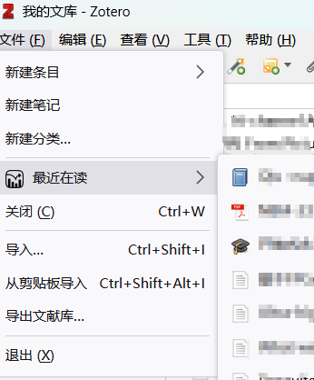

# Chartero
## 简介
记录Zotero内置阅读器的浏览历史并通过各种图形呈现出来，方便读者对过去一段时间内学习过程的复盘与回顾。
## 使用说明
### 首选项参数
- 扫描周期：阅读时记录页码的时间间隔，推荐1秒
- 保存周期：保存历史数据的时间间隔，过小会导致卡顿
### 工具栏按钮<kbd></kbd>
- 标注阅读进度：
点击条目列表上方工具栏中的Chartero按钮，会在每个条目的标题后添加图标来指示该条目的阅读进度。
- 打开文献库概览页面
### 仪表盘
选择文献条目后，右侧边栏将出现“仪表盘”选项卡。
若该条目存在历史记录，则展示阅读进度与各页面的阅读时间。
### 数据存储位置
浏览历史的原始数据以JSON格式保存在一条笔记条目中，
你可以移动他，但不要更改笔记的内容。
- 在新电脑初次同步时，需要手动指定用来存储历史记录的条目：

### 数据可视化
**单**击存储历史记录的笔记条目，右侧边栏会显示记录的树形图。
树形图的右上角有4个按钮：
1. 折叠所有节点：将树形图最小化
2. 复制到剪贴板：记录的原始数据以JSON格式复制
3. 清理无效数据：从记录中删除当前文献库中不存在的条目，同时删除笔记中的xml标签
4. 导入JSON数据：弹出文本输入对话框，粘贴刚复制的原始数据，默认与已有数据*合并*
### 预览所有图片

### 最近在读

### 附加功能
在阅读器中单击PDF页面时，左边栏缩略图自动滚动到当前页面。
## 教程或文档
1. [插件安装](https://zotero.yuque.com/docs/share/6681cf35-55cb-4940-8cb5-ec1db0790099) 
2. [插件开发](https://zotero.yuque.com/books/share/8d230829-6004-4934-b4c6-685a7001bfa0)
3. [视频教程](https://www.bilibili.com/video/BV1AW4y1E7NB)
## 隐私
您的浏览历史将以**明文**形式存储在一个笔记条目中，并可随Zotero数据库同步至云端，
但Chartero插件本身不存在任何访问网络的行为。
## TODO
### bugs
7. 具有多个PDF的条目逻辑问题
9. 偶现同步冲突的问题
10. 苹果系统偶现Overview标签页导致窗口标题显示错位
### features
11. 自动搜索/手动新建
20. 首选项设置需排除的标签
## [FAQ](https://gitee.com/const_volatile/chartero/issues?assignee_id=&author_id=&branch=&collaborator_ids=&issue_search=&label_ids=180755057&label_text=faq&milestone_id=&priority=&private_issue=&program_id=&project_id=const_volatile%2Fchartero&project_type=&scope=&single_label_id=&single_label_text=&sort=&state=closed&target_project=)

- 不兼容的记录格式:
    1. https://gitee.com/const_volatile/chartero/issues/I5Z8CE
    2. https://github.com/volatile-static/Chartero/issues/20
- [不小心删除记录文件](https://gitee.com/const_volatile/chartero/issues/I5WNBI)
- [Zotero本地配置](https://www.zotero.org/support/kb/profile_directory)
- [记录丢失](https://github.com/volatile-static/Chartero/issues/20#issuecomment-1304697609)
## 参与贡献
> *欢迎PR！*
### 软件架构
- 本插件采用纯js编写，无需搭建任何开发环境
- 使用开源脚本[HighCharts](https://www.highcharts.com.cn/)进行各种图表的绘制
- 采用了[jQuery](https://jquery.com/)库简化代码

## 致谢
[windingwind](https://github.com/windingwind)同学是
[pdf-translate](https://github.com/windingwind/zotero-pdf-translate)
与
[better-notes](https://github.com/windingwind/zotero-better-notes)
等热门插件的作者，他在本插件的开发过程中提供了巨大的帮助。
