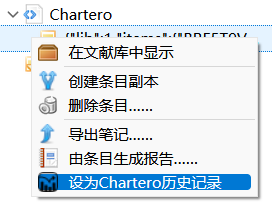

# Chartero
## 简介
记录Zotero内置阅读器的浏览历史并通过各种图形呈现出来，方便读者对过去一段时间内学习过程的复盘与回顾。
## 使用说明
### 首选项参数
- 扫描周期：阅读时记录页码的时间间隔，推荐1秒
- 保存周期：保存历史数据的时间间隔，过小会导致卡顿
### 工具栏按钮<kbd></kbd>
- 标注阅读进度：
点击条目列表上方工具栏中的Chartero按钮，会在每个条目的标题后添加图标来指示该条目的阅读进度。
- 打开文献库概览页面
### 仪表盘
选择文献条目后，右侧边栏将出现“仪表盘”选项卡。
若该条目存在历史记录，则展示阅读进度与各页面的阅读时间。
### 数据存储位置
浏览历史的原始数据以JSON格式保存在一条笔记条目中，
你可以移动他，但不要更改笔记的内容。
- 在新电脑初次同步时，需要手动指定用来存储历史记录的条目：

### 数据可视化
**单**击存储历史记录的笔记条目，右侧边栏会显示记录的树形图。
树形图的右上角有4个按钮：
1. 折叠所有节点：将树形图最小化
2. 复制到剪贴板：记录的原始数据以JSON格式复制
3. 清理无效数据：从记录中删除当前文献库中不存在的条目，同时删除笔记中的xml标签
4. 导入JSON数据：弹出文本输入对话框，粘贴刚复制的原始数据，默认与已有数据*合并*
### 附加功能
在阅读器中单击PDF页面时，左边栏缩略图自动滚动到当前页面。
## 教程或文档
1. [插件安装](https://zotero.yuque.com/docs/share/6681cf35-55cb-4940-8cb5-ec1db0790099) 
2. [插件开发](https://zotero.yuque.com/books/share/8d230829-6004-4934-b4c6-685a7001bfa0)
## 隐私
您的浏览历史将以**明文**形式存储在一个笔记条目中，并可随Zotero数据库同步至云端，
但Chartero插件本身不存在任何访问网络的行为。
## TODO
### bugs
5. 日期时长趋势偶尔不显示当天记录
7. 具有多个PDF的条目逻辑问题
8. 热力图提示遮挡
9. 偶现同步冲突的问题
10. 刚打开就overview会获取不到history
11. 干扰feed的添加
### features
9. 平滑滚动条
10. 优化甘特图标题【用作者？
11. 自动搜索/手动新建
12. 气泡图改为：标签决定连线长短，可下钻，时长决定大小

## 参与贡献
> *欢迎PR！*
### 软件架构
- 本插件采用纯js编写，无需搭建任何开发环境
- 使用开源脚本[HighCharts](https://www.highcharts.com.cn/)进行各种图表的绘制
- 采用了[jQuery](https://jquery.com/)库简化代码
### 常用调试代码
> [Zotero本地配置](https://www.zotero.org/support/kb/profile_directory)
- 获取当前选择的条目：
```js
const items = ZoteroPane.getSelectedItems();
```
- 由key获取条目
```js
Zotero.Items.getByLibraryAndKey(1, 'CQ48G5LG')
```
- 根据当前打开的标签页获取阅读器对象:
```js
Zotero.Reader.getByTabID(Zotero_Tabs.selectedID);
```

- 动态添加阅读器侧边栏的选项卡：
```js
const cont = document.getElementById(`${Zotero_Tabs.selectedID}-context`);
const box = cont.querySelector("tabbox");
box.tabs.append(tab);
box.tabpanels.append(panel);
```

- 修改条目类型：
```js
var item = new Zotero.Item('computerProgram');
item.setType(Zotero.ItemTypes.getID('note'));
```

- 获取某行条目
```js
ZoteroPane.itemsView.getRow(2).ref
```

- 跳转到某条批注
```js
const reader = Zotero.Reader.getByTabID(Zotero_Tabs.selectedID);
const annotations = Zotero.Items.get(reader.itemID).getAnnotations();
reader.navigate({annotationKey: annotations[0].key});
```

<details>
<summary>tree</summary>

```xml
 <tree enableColumnDrag="true" flex="1" id="chartero-data-tree">
    <treecols>
        <treecol id="chartero-data-treecol-k" flex="2" label="" primary="true"/>
        <split class="tree-splitter"/>
        <treecol id="chartero-data-treecol-v" flex="1" label="阅读进度"/>
    </treecols>
    <treechildren>
        <treeitem container="true">
            <treerow>
                <treecell label="Bo"/>
                <treecell label="Bo"/>
            </treerow>
            <treechildren>
        <treeitem container="true">
            <treerow>
                <treecell label="Bo"/>
                <treecell label="Carpenter" />
            </treerow>
            <treechildren>
            </treechildren>
        </treeitem>
        <treeitem container="true">
            <treerow>
                <treecell label="Bo"/>
                <treecell label="Carpenter" />
            </treerow>
            <treechildren>
            </treechildren>
        </treeitem>
            </treechildren>
        </treeitem>
    </treechildren>
</tree>
```

</details>

## 致谢
[windingwind](https://github.com/windingwind)同学是
[pdf-translate](https://github.com/windingwind/zotero-pdf-translate)
与
[better-notes](https://github.com/windingwind/zotero-better-notes)
等热门插件的作者，他在本插件的开发过程中提供了巨大的帮助。
