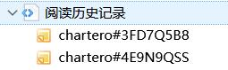
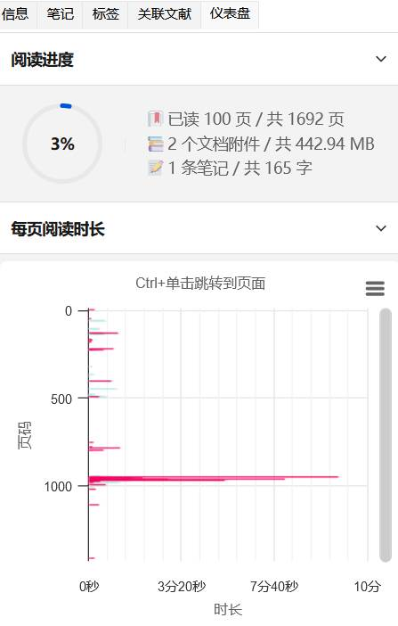
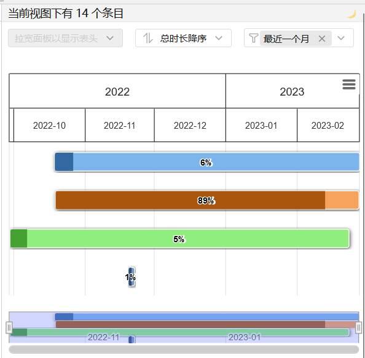
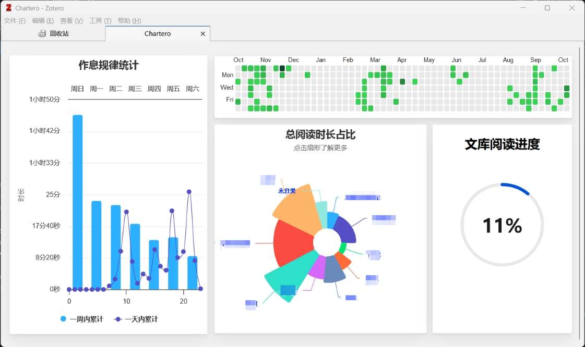

<h1 align='center'>Chartero</h1>
<p align='center'>
    <a href="https://app.codacy.com/gh/volatile-static/Chartero/dashboard?utm_source=gh&utm_medium=referral&utm_content=&utm_campaign=Badge_grade">
        
    </a>
    <a href='../src/'>
        
    </a>
    <a href='https://github.com/volatile-static/Chartero/releases/latest/download/chartero.xpi'>
        
    </a>
    <a href='https://gitee.com/const_volatile/chartero/releases'>
        
    </a>
    <a href='https://gitee.com/const_volatile/chartero/releases/latest'>
        
    </a>
</p>
<p align='center'>
    <a href='../README.md'>English</a> | <kbd>简体中文</kbd>
</p>

## 简介

_Chartero_ 这个名字是连接了 **Char**t 与 Zo**tero**，作为一个[Zotero](https://www.zotero.org/)插件，它可以帮助你更直观地了解你的文献库。

## 使用指南

- ⚠️ 从 Zotero**6**旧版更新后请先前往首选项页面导入旧版历史数据后再使用！！！

### 旧版数据迁移

新版本记录格式采用 note 与附件一、一对应的形式。若当前电脑使用过旧版 chartero，则可在_首选项->存储_中点击“自动搜索并导入旧版数据”按钮，否则需要手动复制旧版 json 数据到文本框中再点击“导入粘贴的历史记录”按钮。**导入时会覆盖已有的新版记录。**

此外，旧版扫描周期以毫秒为单位，新版以秒为单位，**自动导入**时会自动将周期除以 1000，否则需手动修改！。

<details>
<summary>👉 <b>主要功能</b> 👈</summary>

|                     截图                      | 功能                                                                                                                                  |
| :-------------------------------------------: | :------------------------------------------------------------------------------------------------------------------------------------ |
|                        | `Chartero`的核心功能，当你阅读文献时，记录当前页面与时间。                                                                            |
|                        | 在主菜单`文件`中，可以打开最近读过的文档。                                                                                            |
|                          | 在文库视图中新增一列信息显示当前条目的阅读时长。                                                                                      |
|                       | 可视化与当前条目相关的所有信息，在阅读器的侧边栏可实时刷新。                                                                          |
|                       | 总结多个条目之间的关系，若选中条目数超过首选项中设置的值，则不会加载。                                                                |
|                         | 在阅读器滚动条旁边，灰色块表示对应页面的阅读时长，彩色条表示注释。                                                                    |
|                      | 点击`主菜单 → 查看 → 文库总览`后弹出标签页                                                                                            |
|   | 在阅读器左侧边栏显示当前文档中的所有图片。单击可跳转，双击可复制。若 PDF 图片过多，则每次只加载 10 页，点击最下方按钮可手动加载更多。 |

</details>

### [FAQ](https://gitee.com/const_volatile/chartero/issues?label_ids=180755057&label_text=faq&program_id=&project_id=const_volatile%2Fchartero&state=all)

## 开发指南

- [](https://github.com/windingwind/zotero-plugin-template)

- 图表采用 [](https://www.npmjs.com/package/highcharts) 生成
- [Minimap](../src/bootstrap/modules/minimap/)与[图片提取](../src/bootstrap/modules/images/)采用内置 [](https://zh-hans.react.dev/) 渲染
- [图片提取](../src/bootstrap/modules/images/)功能在[ChromeWorker](https://devdoc.net/web/developer.mozilla.org/en-US/docs/Web/API/ChromeWorker.html)中调用内置[PDF.js](https://github.com/zotero/pdf.js)实现。
- UI 组件库使用 [](https://tdesign.tencent.com/vue-next)
- 欲参考纯 JavaScript 版本（适用于 Zotero `6`）请[切换分支](https://gitee.com/const_volatile/chartero/tree/js_overlay/)

### 目录结构

- [addon](../addon/)：存放插件所需的资源文件，详见[模板](https://github.com/windingwind/zotero-plugin-template)
- [tools](../tools/)：存放开发环境所需的脚本文件等
- src
  - [src/bootstrap](../src/bootstrap/)：主窗口环境中运行的代码
    - [src/bootstrap/modules](../src/bootstrap/modules/)：各个功能模块的实现细节
  - [src/vue](../src/vue/)：使用 [Vue](https://cn.vuejs.org/) 的 `iframe` 页面
    - [src/vue/summary](../src/vue/summary/)：分类统计（在文件夹的侧边栏）
    - [src/vue/dashboard](../src/vue/dashboard/)：仪表盘（在普通条目的侧边栏）
    - [src/vue/overview](../src/vue/overview/)：文库概览（单独标签页）
    - [src/vue/utility](../src/vue/utility/)：一些辅助代码
    - [src/vue/test](../src/vue/test/)：测试模块
  - [src/modules](../src/modules/)：Git子仓库，用于在VS Code中调试TS源码
    - 初始化：

        ```bash
        git submodule init
        git submodule update
        ```

  - [src/worker](../src/worker/)：数据处理的后台线程

### URL

这些链接在[bootstrap.js](../addon/bootstrap.js)中注册，可以在Zotero中通过`fetch`函数访问：

- `chrome://chartero/`：访问[addon](../addon/)文件夹
- `resource://chartero/`：访问[addon/content](../addon/content/)文件夹

### 全局变量

与其他插件不同，Chartero 没有在全局 Zotero 变量下定义任何对象，仅可通过侧边栏 iframe 窗口访问`window.addon`。

在_src/bootstrap_与_src/vue_中各有一个 global.d.ts 文件，定义了该目录下可访问的全局变量。
由[zotero-types](https://github.com/windingwind/zotero-types)定义的`Zotero`等变量在 Vue 中**未定义**。
`addon`是整个插件内部的“全局”变量，定义在 SandBox 中，插件外不可访问。新建 iframe 时通过`contentWindow`将其传入 Vue。

### 默认设置

[package.json](../package.json)的`config.defaultSettings`字段定义了插件使用的所有首选项及其默认值，编译时将自动替换[addon](../addon/)中相应内容，**同时在 TS 中提供类型检查**。

### 多语言

[locale](../addon/locale/)文件夹下定义了不同语言在 UI 上显示的字符串，插件启动时动态加载，**同时在 TS 中提供类型检查**。

### 开发环境

[package.json](../package.json)中定义了构建项目所需的 npm 脚本，修改[tools/zotero-cmd.json](../tools/zotero-cmd-template.json)后，在 vscode 的主菜单`Run Task…`中选择指令`npm: build`即可以开发模式全部编译并重载 Zotero。使用带有`NODE_ENV=development`的指令时，全局变量`__dev__`为`true`，插件进入调试模式，此时[debug.ts](../src/bootstrap/modules/debug.ts)会注册一些调试用的选项。

- 以下列出了一些常用的指令：
  - `reload-all`：以**生产**环境全部编译并重载 Zotero
  - `reload-dev`：以**开发**环境跳过vue部分的编译并重载 Zotero
  - `build`：以**开发**环境全部编译并重载 Zotero
  - `watch`：实时监听Vue更改并编译后重载 Zotero
  - `dev`：开启vue测试模块热重载

### ⚡热重载与源码断点

开启Zotero的状态下，在VS Code的侧边栏调试面板中运行`Vue`配置可以开启Vue测试模块的热重载并呼出Firefox，此时可以在Firefox中使用[Vue调试插件](https://addons.mozilla.org/en-US/firefox/addon/vue-js-devtools/)，也可以在VS Code中设置断点进行单步调试。

插件在开发环境下会在[本地服务器](https://www.zotero.org/support/dev/client_coding/connector_http_server)注册一个`/test/chartero`的路由，该节点会`eval`任何POST请求来的指令并以JSON格式返回结果。[Vue测试模块](../src/vue/test/)提供了一系列“dummy”类，通过访问`/test/chartero`路由来仿真Zotero环境，此方法对其他 Zotero 客户端应用具有借鉴价值。

### 阅读记录结构

[history/data.ts](../src/bootstrap/modules/history/data.ts)定义了阅读记录的数据结构。转换成 JSON 字符串后的形式如下：

```json
{
    "pages": {
        "0": {
            "p": {
                "1693200000": 6
            }
        }
    },
    "numPages": 27
}
```

其中`pages`为页码与记录的映射，`numPages`为总页数。`p`意为 **“period”**，其键为时间戳，值为记录**周期**（单位：秒）。

### 插件间兼容性

> 一些不太优雅的实现，可能导致潜在的兼容性问题，供其他插件开发者查错时参考。

- 篡改了`Zotero.Search`对象的`search`方法，使其无法搜索到存储历史记录的笔记条目。

- 显示“所有图片”的侧边栏添加时给其他选项卡按钮添加了点击事件，可能导致冲突。

- 打开“文库总览”时`contextPane.js`会抛出异常`extraData[ids[0]] is undefined`，忽略即可。

## 友情链接

- [🤩 Awesome Zotero Plugins](https://plugins.zotero-chinese.com/charts.html)

---

<br />
<p align='center'></p>
